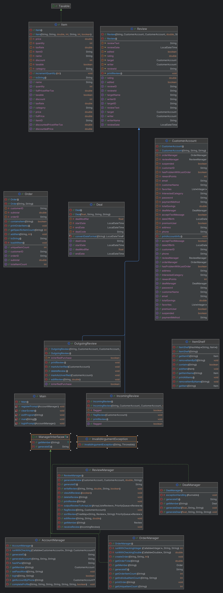

# Links
**email to shih-ru.sheng@sjsu if the links are not working**
**edit permission are only open to SJSU accounts**

### Group Backlog:
https://docs.google.com/spreadsheets/d/1JCvuqDmIKhIHvicyV1MLb2VOi72WebHdFx2wUzmmFq0/edit?usp=sharing

### System Spec:
https://docs.google.com/document/d/1eB-fsnNfyj-h2GCBRhB4DDtd5zsfc9kK/edit?usp=sharing&ouid=104483822282812448340&rtpof=true&sd=true

### Classes Relation UML Diagram (Draw.io):
https://drive.google.com/file/d/1RS94TfMt3VyIdLlMZPf9R-ax0TwSc6-k/view?usp=sharing

### Class Attribute List:
https://docs.google.com/document/d/11A9S_J_n5vefEl1uyRWq90XZ-FxvMnLA/edit?usp=sharing&ouid=104483822282812448340&rtpof=true&sd=true

# Overview
This is our CS 151 Group Project. We built a terminal/console cafe ordering system which simulates an online shopping experience. As per the requirements, we wrote it in Java and implemented many of the properties in OOP (Polymorphism, Interfaces, Inheritance). 

# Design
</img>
<em>UML Diagram of Codebase Pictured Above</em>

<strong>CustomerAccount/AccountManager:</strong> Holds and handles the access/creation of accounts. 
 
<strong>Deal/DealManager:</strong> Holds and handles deals and how they are applied to orders/items
 
<strong>IncomingReview/Review/ReviewManager:</strong> Handles writing, printing, and storing Item Reviews
 
<strong>Order/OrderManager:</strong> Handles the users Cart/Full Order
 
<strong>Taxable:</strong> Implementation of Sales Tax to be applied to Orders
 
<strong>InvalidArgumentException:</strong> Custom exception class for input validation

# Installation Instructions
Pre-requisites:
* Java Version 8 or Above
    - Windows: https://www.oracle.com/java/technologies/downloads/
    - Mac: https://www.oracle.com/java/technologies/downloads/#jdk24-mac or use Homebrew or something
    - Linux: Use your package manager dummy dont waste your time searching on a browser
* Git installed (Above version 2.12)
    - (Optional, but better) SSH Key setup w/ Github (Tutorial here - https://docs.github.com/en/authentication/connecting-to-github-with-ssh)
    - (The easy way) Have GitHub Desktop installed and sign in.

Clone the repository from https://github.com/ProcrastinateGuy/CS151-Spring-2025-Menu-System

# Usage
<strong>Step 1:</strong> Change Directory into src
<strong>Step 2:</strong> Run `java Main`
<strong>Step 3:</strong> Profit????

# Contributions
<strong>Ryan:</strong> Helped integrate Login/Registration, wrote the initial code for the Deal Class, helped with Item/Order Class. Also currently writing this README
 
<strong>Kenan:</strong>
 
<strong>Sean:</strong> Wrote a lot of the code
 
<strong>Efe:</strong>
